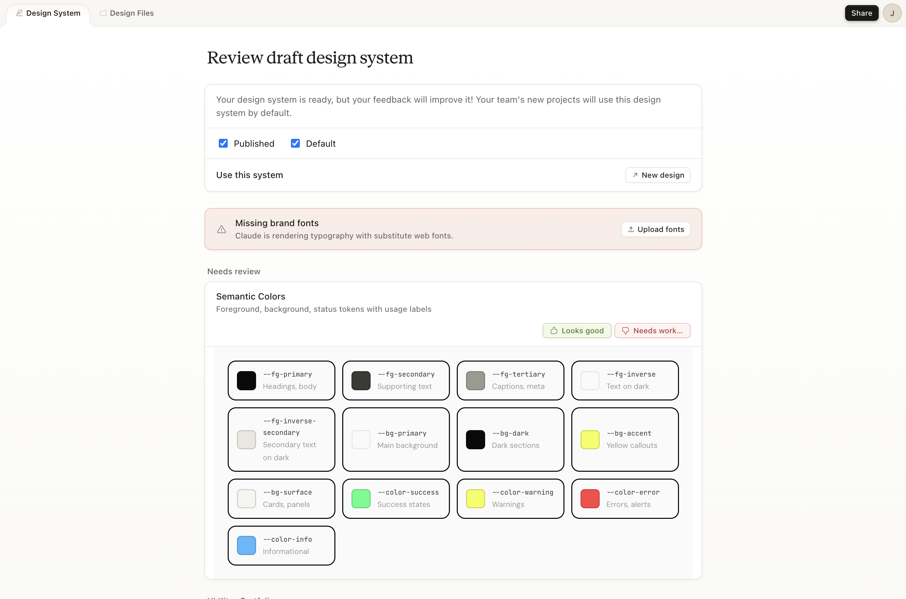
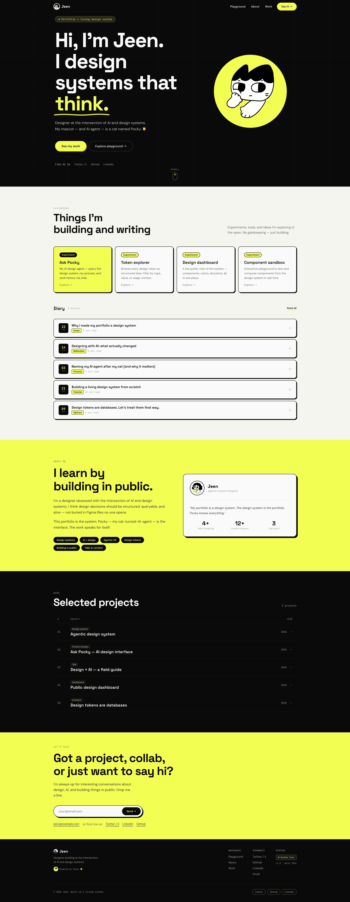

I didn’t want another “pretty portfolio.”

I wanted something real.  
Something that shows how I think, how I build, and how I’m experimenting with design systems + AI.

So I gave myself 2 days.

Not to perfect it.  
Just to get it live.

Here’s exactly what I did (and what I learned).

---

## Step 1: I cheated (with Claude Design)

Instead of starting from Figma… I went straight to Claude Design.

I used it to:
- spin up a **draft design system**
- generate a **first landing page**

Here’s what that looked like 👇

And then it gave me a first draft of the site:

### 🧠 Honest take: it looked pretty good.

But technically, it was kind of messy.

Claude:
- didn’t use proper semantic tokens
- hardcoded colors everywhere
- didn’t really follow system structure

So what I got was a great starting point, not a real design system.

And that’s fine. The goal here was speed first, structure later.

## Step 2: Turn it into a real website with Astro

Once I had something visual, I moved it into code.

I used [Astro](https://astro.build/) because:
- it’s simple
- it’s great for mostly static sites
- it works really well for portfolios, blogs, and content-heavy websites
- it still lets you add interactive parts later

Here’s the basic flow:

1. Create a new Astro project
2. Run it locally
3. Paste the Claude-generated HTML into the homepage
4. Move the styles into CSS files
5. Start refactoring from there

The first local version was not elegant. It was basically “make it render first, make it clean later.”

And honestly, that mindset helped a lot.

## Step 3: Refactor into a real design system

This is where the actual thinking happens.

I went section by section and:
- introduced design tokens
- replaced hardcoded colors with variables
- created reusable CSS classes
- aligned styles with a clearer system structure

For example, instead of letting every section use raw colors like `#0A0A0A` or `#F3FE52`, I started moving toward tokens like `--bg-dark`, `--bg-accent`, `--fg-primary`, and `--fg-on-dark-primary`.

Basically:

> AI gave me speed, but I still had to bring the system thinking.

That’s the important part.

AI can generate a direction, but it doesn’t automatically understand your design system standards, accessibility expectations, or long-term maintainability.

That’s still our job.

## Step 4: Deploy it with Vercel

Once it looked good enough, I made it live.

I used Vercel because:
- it has a free tier
- it connects easily with GitHub
- every push can automatically deploy the latest version

The flow was:

1. Push the Astro project to GitHub
2. Import the repo into Vercel
3. Let Vercel build and deploy it
4. Get a public URL

That’s it.

Once I had a real URL, the project felt different. It wasn’t just an idea anymore. It was something I could open, share, and improve.

## Step 5: Keep improving

The current version is not perfect.

Some parts are still evolving. Some content is placeholder. The system is still forming.

And that’s intentional.

The goal was not to build the perfect portfolio in 2 days.

The goal was to make something real enough to keep building on top of.

## If you want to try this yourself

Here’s the simple version:

1. Use AI to generate a starting point
2. Don’t trust the output blindly
3. Move it into a real website framework like Astro
4. Refactor the design into tokens and reusable styles
5. Push it to GitHub
6. Deploy it with Vercel
7. Improve it section by section

Most designers stay in Figma, drafts, or “almost ready.”

This took 2 days because I focused on making it real, not making it perfect.

If you want to stand out, build something people can actually visit.