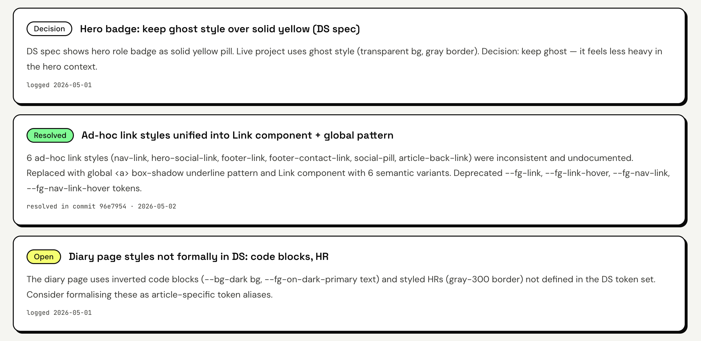

Alright, I didn’t plan this… but my portfolio accidentally turned into a test lab for my own design system 😅

I’ve been trying to build what I call an “agentic” design system — not just components, but something that can **describe itself, track its own issues, and eventually be queried**.

And somewhere along the way:

> I’m not just building a system… I’m *dogfooding* it.

---

## It started simple

At first, it was just:
- tokens  
- components  
- a design system page  

Then I added `system.json`.

It’s a structured file that describes the system:
- components  
- tokens  
- pages  
- issues  

Kind of like:

> a system keeping notes about itself… in a machine-readable way

And that changed everything.

---

## Then reality hit

As I kept building (with AI helping), things got messy fast:

- docs ≠ UI  
- components missing from documentation  
- tokens drifting  
- duplication everywhere  

Pretty normal for design systems.

But AI made it happen **faster**.

---

## Working with AI is fast… until it isn’t

My setup:
- ChatGPT → planning  
- Claude Code → implementation  

At first, it felt magical.

But once I cared about details:

- I started digging into CSS myself  
- fixing issues manually  
- sometimes not even asking Claude  

Because:

> it’s often faster to fix than to explain

And vague prompts?

👉 Always come back with surprises 😅

---

## So I changed how I work

I added a `CLAUDE.md` rulebook:

- don’t invent tokens  
- don’t rename values  
- no hardcoded styles  
- always check source of truth  

Then I made that source of truth explicit.

---

## Then I made the system review itself

I created `/review-ds` — a design system audit step.

It checks:
- token usage  
- hardcoded values  
- accessibility  
- duplication  

At first, it was just a checklist.

But there was a problem.

---

## The problem with audits

They go stale immediately.

Fix something → outdated  
Add something → incomplete  

And once it’s outdated:

👉 it’s useless

---

## So I connected everything

Instead of just reviewing…

I made the system **log results into `system.json`**  
(the same file that powers the UI)

So now:
- issues are logged  
- decisions are logged  
- fixes are logged  

And they show up directly on the site.


---

## The loop now looks like this
```markdown
build → review → log → render → repeat
```

---

## That’s when it clicked

I stopped thinking:

> “I need to keep this clean”

And started thinking:

> “The system should keep itself honest”

---

## Even the structure wasn’t safe

I split the system into:
- Foundations (rules)  
- Components (implementation)  

And still had:
- components leaking into foundations  
- duplication  
- misplaced content  

So I had to enforce:

> Foundations = rules  
> Components = implementation  

---

## The missing layer

`system.json` now sits between:

```markdown
Code → system.json → UI
```

Which means:
- no guessing  
- no relying on memory  
- everything is explicit  

👉 understandable by both humans and **machines**

---

## What this changed for me

- documentation always drifts unless tied to data
- systems shouldn’t rely on memory  
- AI doesn’t remove structure problems — it exposes them  
- automation isn’t about speed, it’s about **honesty**

---

## Where this is going

Next:
- a dashboard to see system health  
- “Ask Pocky” to query the system  

---

## Final thought

This started as a portfolio.

Now it feels like:

> a system that’s learning how to explain itself

---

## If you’re building a design system

Next time you fix something:

👉 don’t just fix it — log it

That alone changes how your system evolves.